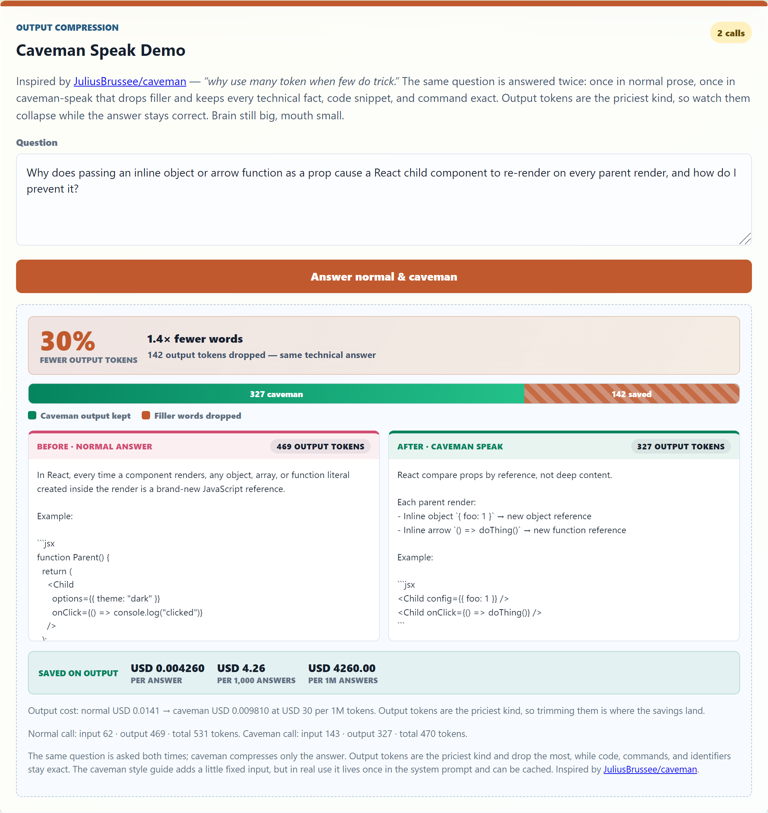

# Token Efficiency Samples

> A Java 21 / Spring Boot sample for Microsoft Foundry **instant models** that makes token cost visible on every call.

**Slides:** [doc/Slides.pdf](doc/Slides.pdf)

**Live app:** [http://aka.ms/costs](http://aka.ms/costs)

Call supported models by name—no deployment required—and see input, output, and cached tokens priced live against real Azure Retail Prices meters. The web dashboard offers four demos (the CLI covers the instant and prompt-cache flows):

- **Instant Demo** — prices a single live model-by-name call and compares instant vs. deployed rates.
- **Prompt Cache Demo** — warms a long stable prefix, then shows the cold→warm token savings on a repeated call.
- **Compaction Demo** — condenses long working notes into a short durable summary and shows the before→after token drop.
- **Caveman Speak Demo** — answers the same question normally and in terse "caveman" style, showing the output-token drop while code and facts stay exact.

Authentication uses Microsoft Entra (`DefaultAzureCredential`); deployment uses Azure Container Apps via `azd`. No API keys or secrets are stored in this repo.

## Contents

- [Quick Start](#quick-start)
- [Example Overview](#example-overview)
- [What It Does](#what-it-does)
- [Screenshots](#screenshots)
- [Prerequisites](#prerequisites)
- [Configure](#configure)
- [Provision Azure Resources](#provision-azure-resources)
- [Configuration Reference](#configuration-reference)
- [Run](#run)
- [Prompt Cache Demo](#prompt-cache-demo)
- [Compaction Demo](#compaction-demo)
- [Caveman Speak Demo](#caveman-speak-demo)
- [Example Output](#example-output)
- [Token Efficiency Principles](#token-efficiency-principles)
- [Token Efficiency Analyzer Agent](#token-efficiency-analyzer-agent)
- [Cost Calculation](#cost-calculation)
    - [`gpt-chat-latest` vs `gpt-5.5` Pricing](#gpt-chat-latest-vs-gpt-55-pricing)
    - [Instant versus deployed pricing](#instant-versus-deployed-pricing)
- [Project Layout](#project-layout)

## Quick Start

```powershell
az login
Copy-Item .env.example .env   # then set FOUNDRY_PROJECT_ENDPOINT
mvn spring-boot:run
```

> Inside a dev container or GitHub Codespace, the browser sign-in flow is unavailable. Use `az login --use-device-code` instead.

Open `http://localhost:8080` and run the four demos. For the full Azure provision-and-deploy path, jump to [Provision Azure Resources](#provision-azure-resources).

## Example Overview

Instant models in Microsoft Foundry let you call supported models by name without first creating a deployment. They are useful for prototyping, comparing models, trying new releases quickly, and building early application flows before you decide whether you need a dedicated deployment for reserved throughput, custom controls, or production isolation.

Instant models are still quota-governed. During preview, they draw from a per-model global quota pool assigned to your subscription, and requests can be throttled if available capacity is exceeded. If you see rate-limit responses such as HTTP 429, add retry logic with backoff and consider requesting a quota increase or moving production traffic to a deployment with reserved capacity. See [Instant models in Microsoft Foundry](https://learn.microsoft.com/en-us/azure/foundry/concepts/instant-models) and [Microsoft Foundry Models quotas and limits](https://learn.microsoft.com/en-us/azure/foundry/foundry-models/quotas-limits) for the current guidance.

Sanitized validation finding: one West US 3 subscription checked during development reported a Tier 5 `gpt-chat-latest` Global Standard quota of `50,000` requests per minute and `5,000,000` tokens per minute, with no Global Standard deployment quota reserved at the time of the check. Treat this as a point-in-time example only; your subscription, quota tier, model, region, and reserved deployments can change the effective limit. Runtime response headers such as `x-ratelimit-limit-tokens`, `x-ratelimit-remaining-tokens`, and `retry-after-ms` are the best signal for live throttling behavior.

This Java sample calls an instant model from a Foundry project endpoint, prints token usage, and estimates cost per call with live pricing from the Azure Retail Prices API. It follows the Microsoft Foundry Java quickstart pattern with `com.azure:azure-ai-agents:2.0.0`.

## What It Does

- Calls a Microsoft Foundry project endpoint with the Responses API.
- Uses an instant model by name, so no model deployment is required.
- Loads local settings from `.env`, while keeping `.env` out of git.
- Prints the model response plus input, output, total, and cached-input token usage.
- Prices every instant call live, color-codes the three token types by price-intensity (cooler = cheaper per token, warmer = pricier), and projects the cost to 1,000 and 1M calls.
- Shows token mix versus cost mix as two aligned bars, so the small but expensive output share is obvious at a glance.
- Compares the instant (standard pay-as-you-go) per-call price against the same model's data-zone and priority-processing meters, all pulled live from the Azure Retail Prices API.
- Visualizes prompt cache warming in real time, comparing a cold warm-up call with a warm repeated call and showing the cached prefix that was loaded.
- Compacts long working notes into a shorter reusable prompt and shows request-level token savings.
- Answers a question twice—normal prose and terse "caveman" style—to show how much output-token spend drops when filler is cut while code, commands, and facts stay exact.
- Looks up current prices at runtime from `https://prices.azure.com/api/retail/prices`.
- Estimates per-call cost from the returned token usage and live retail pricing meters.

## Screenshots


The dashboard presents four token-efficiency workflows: a live-priced instant model call, real-time prompt cache warming, prompt compaction, and caveman-speak output compression. The hero above shows the first three; the caveman demo is captured below.


The instant demo opens with a short explainer: an instant model is called by name, needs no deployment to create or manage, is available to every Foundry project, and bills at standard pay-as-you-go rates. It then prices a single call live against Azure Retail Prices meters, leading with the per-call cost and projecting it to 1,000 and 1M calls. The three token types—cached input, standard input, and output—are color-coded on a price-intensity scale (cooler is cheaper per token, warmer is more expensive), and two aligned bars compare token *count* against token *cost* so the small-but-expensive output share stands out. Each rate card carries a colored unit-price chip (for example output at roughly 60× the cached-input rate per token). An instant-versus-deployed comparison prices the same tokens against the data-zone and priority-processing meters so you can see how much cheaper the standard instant path is. Live values vary by model, prompt, region, quota, and current retail pricing response.


The prompt cache demo warms the model cache in real time. A cold warm-up call primes a long stable prefix, then a warm repeated call reuses it: the animated gauge fills to the cache-hit rate, the cold-versus-warm cards compare cost, and the panel shows exactly what was loaded into cache plus the savings per reuse.


The compaction demo turns long working notes into a shorter reusable summary, showing tokens saved, reduction percentage, and the cost of the compaction call itself.



The caveman speak demo answers the same question twice—once in normal prose, once in terse "caveman" style inspired by [JuliusBrussee/caveman](https://github.com/JuliusBrussee/caveman)—and shows the before→after output-token drop, the reduction percentage, and the cost saved on the priciest (output) meter, while code, commands, and identifiers stay exact.

## Prerequisites

- Java 21 or newer
- Maven 3.9 or newer
- Azure CLI
- A Microsoft Foundry project in a region that supports instant models during preview
- A signed-in Azure user with the Foundry User role on the project or account

Sign in before running the sample:

```powershell
az login
```

> In a dev container or GitHub Codespace, run `az login --use-device-code` because the local browser redirect is not available.

## Configure

Create a local `.env` file from the checked-in template:

```powershell
Copy-Item .env.example .env
notepad .env
```

Set your Foundry project endpoint:

```text
FOUNDRY_PROJECT_ENDPOINT=https://<resource-name>.services.ai.azure.com/api/projects/<project-name>
```

The app reads real environment variables first, then falls back to `.env`. This lets CI/CD or shell variables override local development settings.

## Provision Azure Resources

This repo includes an Azure Developer CLI (`azd`) and Bicep setup that creates the resources needed for the sample:

- Resource group
- Azure AI Services account with Foundry project management enabled
- Microsoft Foundry project
- Azure AI User role assignment for the signed-in deployer on the Foundry project
- Azure Container Registry
- Azure Container Apps environment and Container App
- Managed identity with ACR pull and Foundry project access

The default location is `westus3`, which is the preview region used for instant model testing.

```powershell
az login
azd auth login
azd env new instantmodels --location westus3
azd up
```

> In a dev container or GitHub Codespace, use the device-code flow for both sign-ins: `az login --use-device-code`

`azd up` provisions the Azure resources, builds the Spring Boot Docker image locally, pushes it to Azure Container Registry, deploys it to Azure Container Apps, and prints the live endpoint. Local Docker must be running because this template intentionally disables ACR remote build.

For later code-only updates, run:

```powershell
azd deploy web
```

The service is mapped in [azure.yaml](azure.yaml) as a standard `containerapp` service with a local Docker build. The Bicep tags the Container App with `azd-service-name: web` so azd can deploy to it.

To remove the Azure resources later:

```powershell
azd down
```

## Configuration Reference

| Setting | Required | Default | Description |
| --- | --- | --- | --- |
| `FOUNDRY_PROJECT_ENDPOINT` | Yes | None | Foundry project endpoint, for example `https://<resource>.services.ai.azure.com/api/projects/<project>` |
| `FOUNDRY_MODEL` | No | `gpt-chat-latest` | Instant model name passed to the Responses API |
| `FOUNDRY_PROMPT` | No | A one-sentence instant models prompt | Prompt sent to the selected model |
| `FOUNDRY_PRICING_REGION` | No | `westus3` | Azure Retail Prices `armRegionName` used for pricing lookup |
| `FOUNDRY_PRICING_CURRENCY` | No | `USD` | Currency code passed to the Retail Prices API |
| `FOUNDRY_PRICING_SCOPE` | No | `Gl` | Retail meter scope. `Gl` is global; `Dz` is data zone |
| `FOUNDRY_PRICING_METER_PREFIX` | No | Model-derived | Override when a model alias maps to a specific retail meter family |

For `gpt-chat-latest`, this sample maps the model alias to the `5.5 ShortCo` retail meter prefix. If your selected model maps differently, set `FOUNDRY_PRICING_METER_PREFIX` in `.env`.

## Run

From a clean checkout, run:

```powershell
mvn test
mvn compile exec:java
```

To run the Spring Boot web dashboard locally:

```powershell
mvn spring-boot:run
```

Open `http://localhost:8080` and use the buttons to price a live instant call (**Run instant model & price it**), warm the prompt cache (**Warm the cache**), compact working notes (**Compact prompt**), or compress an answer into caveman speak (**Answer normal & caveman**).

Use `mvn compile exec:java` after `mvn clean` or from a fresh clone. `mvn exec:java` by itself only works after classes already exist under `target/classes`.

Optional one-off overrides:

```powershell
$env:FOUNDRY_MODEL = "gpt-chat-latest"
$env:FOUNDRY_PROMPT = "Explain instant models in one sentence."
mvn compile exec:java
```

## Prompt Cache Demo

The default sample is intentionally small, so it usually has no cached input tokens. For demos, use the dedicated prompt-cache example. It sends the same long prompt twice with a stable `promptCacheKey`, then compares the warm-up call with the repeated call. This demo intentionally uses a much longer prompt than the default sample so the cache behavior is visible. In the web dashboard, the **Warm the cache** button shows this as a real-time animation: an animated cache gauge fills to the hit rate, the cold warm-up and warm repeated calls are compared side by side, and the panel lists exactly what was loaded into cache.

```powershell
mvn compile exec:java '-Dexec.mainClass=com.example.instantmodels.PromptCacheDemoApp'
```

The repeated call should show cached input tokens when the service reuses the long prompt prefix:

```text
Prompt cache demo
Model: gpt-chat-latest
Cache key: im-cache-<run-id>
Prompt characters: 60935

Warm-up call
Usage: input=10045 tokens, output=33 tokens, total=10078 tokens
Cache details: standard-input=10045 tokens, cached-input=0 tokens, cache-hit-rate=0.00%
Estimated cost: USD 0.05121500
Estimated cache savings versus uncached input: USD 0.00000000

Repeated call
Usage: input=10045 tokens, output=34 tokens, total=10079 tokens
Cache details: standard-input=317 tokens, cached-input=9728 tokens, cache-hit-rate=96.84%
Estimated cost: USD 0.00746900
Estimated cache savings versus uncached input: USD 0.04377600
```

## Compaction Demo

The dashboard also includes a compaction demo for long assistant working notes. Paste or edit the working notes, then select **Compact prompt**. The app sends the notes with a compaction instruction that tells the model to:

1. Rewrite the working notes as a concise durable summary in at most six sentences, with no bullets or nested lists.
2. Keep only next-turn essentials — goal, key facts, docs or files to update, validation and deploy commands, blockers, and privacy constraints.
3. Drop repetition, resolved dead ends, greetings, transient logs, and exact values that aren't needed for the next step (for example, summarizing quota findings as sanitized evidence instead of repeating every number).
4. Return only the compacted summary.

Unlike the Caveman Speak Demo — which keeps every fact and code snippet exact and only trims filler from a single answer — compaction deliberately *summarizes*, trading some detail to shrink the input carried into later turns.

The result shows:

- Source tokens reported by the service for the compaction request.
- Compacted tokens reported as the response output tokens.
- Tokens saved and reduction percentage for future prompts that use the compacted summary instead of the original notes.
- Estimated cost of the compaction call itself.

Compaction is a tradeoff: the current compaction call still costs input and output tokens, but later turns can avoid repeatedly sending the full raw transcript. Before compacting, durable facts should be captured in code, tests, README notes, issues, or a short checklist because a compacted summary might not preserve exact wording or every branch of reasoning.

## Caveman Speak Demo

The dashboard's fourth demo is web-only and inspired by [JuliusBrussee/caveman](https://github.com/JuliusBrussee/caveman) — *"why use many token when few do trick."* Select **Answer normal & caveman** to ask the same question twice:

1. A **normal** answer in full prose.
2. A **caveman** answer that drops filler words, articles, and pleasantries and uses short telegraphic fragments, while keeping every technical fact and keeping code, commands, file paths, API names, and error strings exact.

The result shows the two answers side by side with:

- Output tokens for each answer and the before→after reduction percentage.
- Tokens saved on output (the priciest per-token meter).
- Estimated cost saved on output, projected to 1,000 and 1M answers.

Caveman speak compresses only the model's output; the question is unchanged. Output tokens bill at the highest rate (for `5.5 ShortCo`, `USD 30 / 1M` versus `USD 5 / 1M` input), so trimming them is where the savings land. A representative deployed run reduced a React explanation from `469` output tokens to `327` (about `30%` fewer, `1.4×` smaller) while keeping the fix and every code snippet (`useMemo`, `useCallback`) exact. The caveman style guide adds a little fixed input per call, but in real use it lives once in a system prompt and can be prompt-cached, so the output savings dominate across a conversation.

## Example Output

The exact response and token counts vary by run, but the output looks like this:

```text
Model: gpt-chat-latest
Response: Instant models in Microsoft Foundry are preconfigured AI models designed for immediate use with low-latency inference.
Usage: input=19 tokens, output=106 tokens, total=125 tokens
Cache details: standard-input=19 tokens, cached-input=0 tokens, cache-hit-rate=0.00%
Pricing: input=USD 5 per 1M tokens, cached-input=USD 0.5 per 1M tokens, output=USD 30 per 1M tokens (model=gpt-chat-latest, meter-prefix=5.5 ShortCo, region=westus3, scope=Gl, retrieved=2026-06-04T07:58:17Z)
Pricing meters: input='5.5 ShortCo inp Gl 1M Tokens', cached-input='5.5 ShortCo cd inp Gl 1M Tokens', output='5.5 ShortCo opt Gl 1M Tokens'
Cost breakdown: standard-input=USD 0.00009500, cached-input=USD 0.00000000, output=USD 0.00318000
Estimated cost: USD 0.00327500
```

## Token Efficiency Principles

Token efficiency means getting the answer you need with the smallest useful prompt, model, and tool surface. This sample makes that visible by printing input, output, cached-input, and cost for every call.

- **Drop unused tools.** MCP servers and tool connections add definitions and schemas that cost tokens before the model even answers. The instant demo attaches no tools, so the request stays small.
- **Use the smallest model that fits.** The app defaults to `gpt-chat-latest`, but compare cheaper instant models for summarization, classification, routing, or short Q&A.
- **Scope sessions tightly.** The instant demo asks one focused question (`19` input tokens in the sample output) instead of carrying long history into tasks that don't need it.
- **Compact long conversations** once durable context is captured. Replacing a raw transcript with a concise summary cuts input tokens on later turns; the Compaction Demo reports tokens saved, reduction percentage, and the call's own cost. Save key facts in code, tests, or issues first, since a summary may drop exact wording.
- **Keep prompts precise and short.** The instant demo prompt is a single sentence; the cache demo uses a large prefix only to show when caching helps.
- **Prefer a direct completion** over chat or agent workflows for one-shot jobs. Agents only pay off when you need planning, tools, state, or multi-step behavior.
- **Reuse stable context with prompt caching.** In the cache demo the warm-up pays for the full prompt and the repeat reuses the prefix. A verified run hit `9728` cached tokens (~`96%`), cutting cost from ~`USD 0.051` to ~`USD 0.007`.
- **Watch output, not just input.** Short prompts can still get expensive with long answers, so the dashboard shows output tokens and cost separately. The Caveman Speak Demo makes this concrete: cutting filler from the answer drops output tokens (the priciest meter) while keeping every fact and code snippet exact.

## Token Efficiency Analyzer Agent

The repo ships a VS Code custom agent profile at `.github/agents/instantmodels.agent.md` that turns these principles into on-demand advice. Paste a prompt or ask a token-efficiency question and the **Token Efficiency Analyzer** returns concise, prioritized guidelines—smaller model, tighter prompt, dropped tools, caching, or compaction—for the case at hand.

- It advises only: read-only, with no demos, measurements, charts, or code edits.
- It leads with the single highest-impact change, then flags output-length risk (a short prompt can still produce a long, costly answer).
- For exact token and cost numbers, it points you back to the live instant flow (`mvn compile exec:java`).

## Cost Calculation

The Responses API returns usage metadata. The sample uses those token counts and live retail pricing meters to estimate cost.

Base formula:

```text
cost = (input_tokens / 1,000,000 * input_price_per_1M_tokens)
	+ (output_tokens / 1,000,000 * output_price_per_1M_tokens)
```

If the response reports cached input tokens and the retail catalog has a cached-input meter, cached tokens use the cached-input rate:

```text
cost = (standard_input_tokens / 1,000,000 * input_price_per_1M_tokens)
	+ (cached_input_tokens / 1,000,000 * cached_input_price_per_1M_tokens)
	+ (output_tokens / 1,000,000 * output_price_per_1M_tokens)
```

The Azure Retail Prices API is queried at runtime, so the estimate reflects the current public retail catalog response for the configured model meter prefix, region, currency, and scope. Your actual bill can still differ if your subscription has discounts, commitments, credits, or private pricing.

### `gpt-chat-latest` vs `gpt-5.5` Pricing

In this demo, `gpt-chat-latest` maps to the `5.5 ShortCo` retail meters. That makes it cheaper than a `5.5 LongCo` path, but not cheaper than `gpt-5.5` when `gpt-5.5` is also billed as `ShortCo`.

Current `westus3` global retail meters:

| Meter family | Input | Cached input | Output |
| --- | ---: | ---: | ---: |
| `5.5 ShortCo` | USD 5 / 1M | USD 0.50 / 1M | USD 30 / 1M |
| `5.5 LongCo` | USD 10 / 1M | USD 1 / 1M | USD 45 / 1M |

So the important distinction is the billing family: `ShortCo` is the lower-cost path, and `LongCo` costs more. In this app, the observed `gpt-5.5` call also resolves to `5.5 ShortCo`, so it has the same per-token rates as `gpt-chat-latest` for the tested configuration.

### Instant versus deployed pricing

An instant model is called by name and bills at the standard pay-as-you-go (Global Standard) rate. The instant demo also prices the same call's tokens against the model's data-zone and priority-processing meters so the savings are concrete. All three rows come from the same live Azure Retail Prices response, so nothing is hardcoded.

| Tier (`5.5 ShortCo`, `westus3`) | Input | Cached input | Output | Relative |
| --- | ---: | ---: | ---: | ---: |
| Standard / Global (instant) | USD 5 / 1M | USD 0.50 / 1M | USD 30 / 1M | baseline |
| Data Zone deployment | USD 5.50 / 1M | USD 0.55 / 1M | USD 33 / 1M | ~1.1x |
| Priority Processing | USD 12.50 / 1M | USD 1.25 / 1M | USD 75 / 1M | ~2.5x |

An instant model and a Global Standard deployment of the same model bill at the same per-token rate, so the savings shown are versus the data-zone and priority-processing tiers, not versus every deployment. These values are point-in-time examples and vary by model, region, currency, and the current retail catalog.

## Project Layout

```text
.
|-- .env.example
|-- .github/agents/                 # VS Code custom agents (Token Efficiency Analyzer profile)
|-- AGENTS.md                       # Guidance for coding agents
|-- Dockerfile                      # Spring Boot container build (local build, no ACR remote build)
|-- azure.yaml                      # azd service definition (web -> Container App)
|-- pom.xml
|-- README.md
|-- article-assets/                 # README screenshots + Playwright capture script
|-- infra/                          # Bicep: Foundry, ACR, Container Apps, managed identity, RBAC
|   |-- container-app.bicep
|   |-- foundry.bicep
|   |-- main.bicep
|   `-- main.parameters.json
`-- src
    |-- main
    |   |-- java/com/example/instantmodels
    |   |   |-- DemoController.java              # Web endpoints for the four demos
    |   |   |-- DemoRunService.java              # Shared demo + pricing logic
    |   |   |-- InstantModelsApp.java            # CLI entry point
    |   |   |-- InstantModelsConfig.java         # Env / .env configuration
    |   |   |-- InstantModelsWebApplication.java # Spring Boot web entry point
    |   |   |-- ModelPricing.java
    |   |   |-- PromptCacheDemoApp.java          # CLI prompt-cache demo
    |   |   `-- RetailPricingClient.java         # Live Azure Retail Prices lookup
    |   `-- resources
    |       |-- application.properties
    |       |-- simplelogger.properties
    |       `-- static                           # Web dashboard: index.html, app.js, styles.css
    `-- test/java/com/example/instantmodels
        |-- DemoRunServiceTest.java
        `-- InstantModelsConfigTest.java
```
